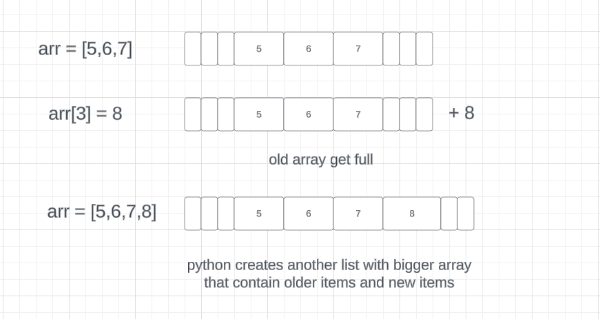

## Arrays in Python are Dynamic!

# No they are not Dynamic.
---

they use an algorithmic sleight of hand known as a dynamic array.
When we initialize an List for suppose 5 Items  underneath Python creates a array that can contain for ex 8 items, and at a point when the array get full python creates another array bigger then the previous one that can contain the item of previous list as well the new items. The new list gets the Address of the items of the old list

# Ex:

```
import ctypes

class DynamicArray:
	"""A dynamic array class akin to a simplified Python list."""

	def __init__(self):
		"""Creates an Empty array"""
		self._n = 0
		self._capacity = 1
		self._A = self._make_array(self._capacity)

	def __len__(self):
		"""return number of elements stored in the array."""
		return self._n

	def __getitem(self,k):
		"""Return element at index k"""
		if not 0 <= k < self._n:
			raise IndexError('invalid index')
		return self._A[k]

	def _resize(self, c):
		"""Resize internal array to capacity c"""
		B = self._make_array(c)
		for k in range(self._n):
			B[k] = self._A[k]
		self._A = B
		self._capacity = c

	def _make_array(self, c):
		"""Return new array with capacity c"""
		return (c * ctypes.py_object)()

	def append(self, obj):
		"""Add object to end of the array"""
		if self._n == self._capacity:
			self._resize(2 * self._capacity)
		self._A[self._n] = obj
		self._n += 1

```
