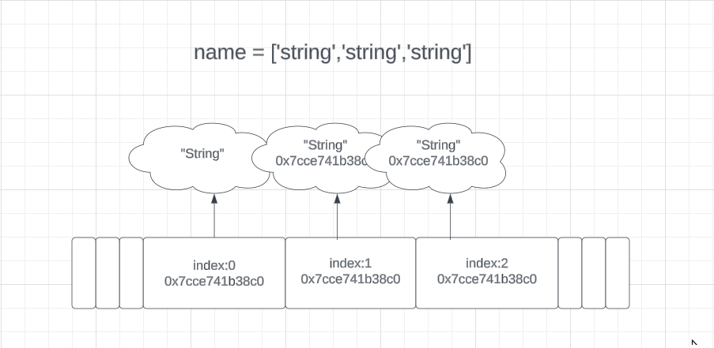

Python stores Address of objects in a list with index that refers to the objects
Each index is given a fixed space of 64 bits i.e 8 bytes to store the address of the object in the memory

Shallow copy: When creating a new List from Existing one or Slicing from existing List, when the data is Immutable the new List just hold the Refference to the original object

Deep copy: When the data type is mutable it creates a new copy of the existing List with new elements using the deepcopy function from the copy module

Ex.Refferential Array

 

